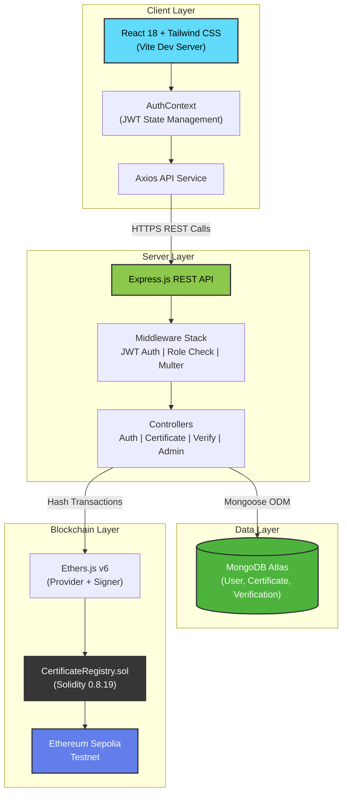
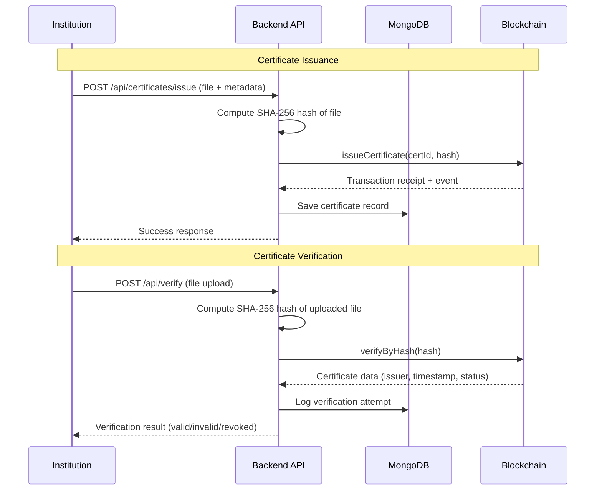
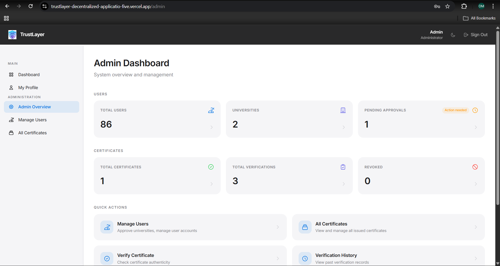
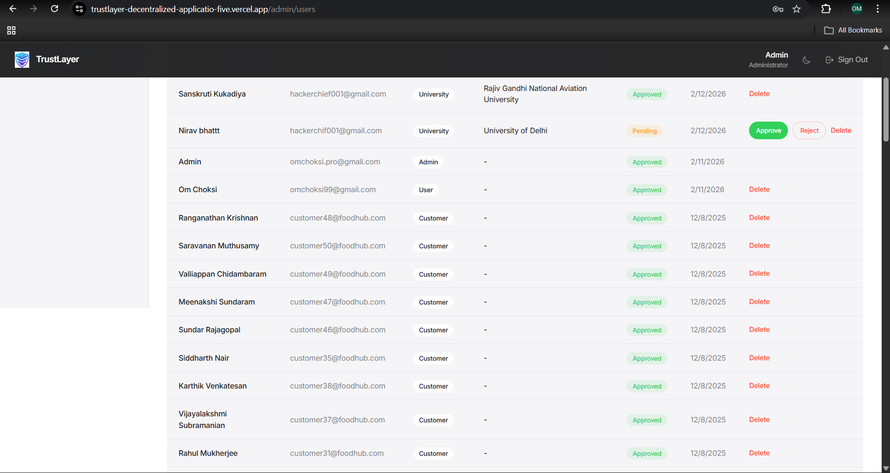
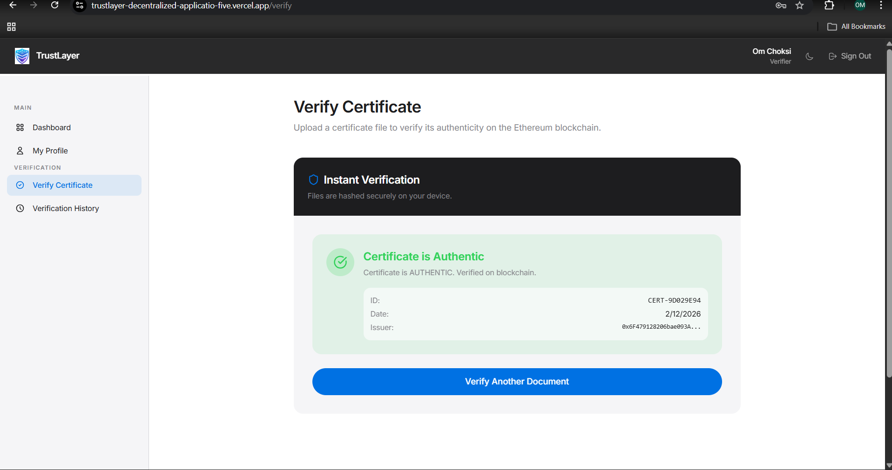

<div align="center">

# TrustLayer

### Blockchain-Based Secure Certificate Verification System

[](https://trustlayer-decentralized-applicatio-five.vercel.app)
[](https://sepolia.etherscan.io/)
[](LICENSE)
[](https://nodejs.org/)
[](https://react.dev/)
[](https://soliditylang.org/)

**A full-stack decentralized application that leverages Ethereum blockchain technology to provide a secure, tamper-proof, and transparent system for issuing, storing, and verifying academic and professional certificates.**

[Live Demo](https://trustlayer-decentralized-applicatio-five.vercel.app) · [Report Bug](https://github.com/OMCHOKSI108/Blockchain-Based-Secure-Certificate/issues) · [Request Feature](https://github.com/OMCHOKSI108/Blockchain-Based-Secure-Certificate/issues)

</div>

---

## Table of Contents

- [About the Project](#about-the-project)
- [Key Features](#key-features)
- [System Architecture](#system-architecture)
- [Screenshots](#screenshots)
- [Tech Stack](#tech-stack)
- [Project Structure](#project-structure)
- [Getting Started](#getting-started)
- [Environment Variables](#environment-variables)
- [Running the Application](#running-the-application)
- [Smart Contract](#smart-contract)
- [API Endpoints](#api-endpoints)
- [Contributing](#contributing)
- [License](#license)

---

## About the Project

TrustLayer solves the critical problem of **certificate fraud** in academic and professional environments. By storing a unique SHA-256 hash of each certificate on the Ethereum blockchain, it creates an immutable record that can be independently verified by anyone — employers, universities, or regulatory bodies — without relying on a central authority.

The platform provides a seamless workflow: institutions issue certificates through the web interface, the system computes a cryptographic hash and records it on-chain, and verifiers can instantly authenticate any certificate by uploading it for hash comparison against the blockchain record.

---

## Key Features

| Feature | Description |
|---|---|
| **Blockchain Integrity** | Certificate hashes stored on Ethereum Sepolia testnet — tamper-proof and globally verifiable |
| **Role-Based Access Control** | Three distinct roles: **Admin**, **Institution**, and **Verifier** with scoped permissions |
| **Certificate Lifecycle** | Full issue → verify → revoke workflow with on-chain event logging |
| **Email Verification** | Account activation via email link to prevent unauthorized registrations |
| **Real-Time Verification** | Upload a certificate and get instant blockchain-backed authenticity confirmation |
| **Verification History** | Complete audit trail of all verification attempts |
| **Responsive UI** | Modern, mobile-friendly interface built with React and Tailwind CSS |

### Role Breakdown

| Role | Capabilities |
|---|---|
| **Admin** | Approve/reject institution registrations, manage all users, view all certificates |
| **Institution** | Issue new certificates, view issued certificates, revoke certificates |
| **Verifier / Employer** | Upload and verify certificate authenticity, view verification history |

---

## System Architecture



### Data Flow — Certificate Issuance & Verification



---

## Screenshots

### Admin Dashboard
<div align="center">
  
  <p><em>Admin dashboard showing system overview and user management controls</em></p>
</div>

### User Management (Admin View)
<div align="center">
  
  <p><em>Admin interface for managing users and institution approvals</em></p>
</div>

### Certificate Verification
<div align="center">
  
  <p><em>Certificate verification interface showing blockchain-backed authenticity check</em></p>
</div>

---

## Tech Stack

### Frontend
| Technology | Purpose |
|---|---|
| **React 18** | Component-based UI framework |
| **Vite 5** | Fast build tool and dev server |
| **Tailwind CSS 3** | Utility-first CSS framework |
| **React Router 6** | Client-side routing |
| **Axios** | HTTP client for API requests |
| **React Hot Toast** | Notification system |

### Backend
| Technology | Purpose |
|---|---|
| **Node.js 18+** | JavaScript runtime |
| **Express 4** | REST API framework |
| **MongoDB + Mongoose** | Document database and ODM |
| **Ethers.js v6** | Ethereum blockchain interaction |
| **JSON Web Tokens** | Stateless authentication |
| **bcrypt.js** | Password hashing |
| **Multer** | Multipart file upload handling |
| **Nodemailer** | Email verification service |

### Blockchain
| Technology | Purpose |
|---|---|
| **Solidity 0.8.19** | Smart contract language |
| **Hardhat** | Development & deployment framework |
| **Ethereum Sepolia** | Test network for contract deployment |

### DevOps & Hosting
| Technology | Purpose |
|---|---|
| **Vercel** | Frontend and backend deployment |
| **MongoDB Atlas** | Cloud-hosted database |
| **QuickNode** | Ethereum RPC provider |

---

## Project Structure

```
Blockchain-Based-Secure-Certificate/
├── client/                          # React Frontend
│   ├── public/                      # Static assets
│   ├── src/
│   │   ├── components/              # Reusable UI components
│   │   │   ├── Footer.jsx
│   │   │   ├── Layout.jsx
│   │   │   ├── Navbar.jsx
│   │   │   ├── Sidebar.jsx
│   │   │   └── UniversityFooter.jsx
│   │   ├── context/
│   │   │   └── AuthContext.jsx      # Authentication state management
│   │   ├── pages/                   # Application pages
│   │   │   ├── AdminDashboard.jsx
│   │   │   ├── AllCertificates.jsx
│   │   │   ├── Dashboard.jsx
│   │   │   ├── IssueCertificate.jsx
│   │   │   ├── Login.jsx
│   │   │   ├── ManageUsers.jsx
│   │   │   ├── MyCertificates.jsx
│   │   │   ├── Profile.jsx
│   │   │   ├── Register.jsx
│   │   │   ├── VerificationHistory.jsx
│   │   │   ├── VerifyCertificate.jsx
│   │   │   └── VerifyEmail.jsx
│   │   ├── services/
│   │   │   └── api.js               # Axios API configuration
│   │   ├── App.jsx                  # Root component with routing
│   │   ├── index.css                # Global styles
│   │   └── main.jsx                 # Entry point
│   ├── index.html
│   ├── package.json
│   ├── tailwind.config.js
│   ├── vite.config.js
│   └── vercel.json                  # Vercel deployment config
│
├── backend/                         # Node.js Backend
│   ├── config/
│   │   ├── blockchain.js            # Ethers.js provider & contract setup
│   │   ├── contractData.json        # Deployed contract address & ABI
│   │   └── db.js                    # MongoDB connection
│   ├── controllers/
│   │   ├── adminController.js       # Admin operations
│   │   ├── authController.js        # Auth & registration logic
│   │   ├── certificateController.js # Issue & manage certificates
│   │   └── verifyController.js      # Certificate verification logic
│   ├── middleware/
│   │   ├── auth.js                  # JWT authentication middleware
│   │   └── roleCheck.js             # Role-based access control
│   ├── models/
│   │   ├── Certificate.js           # Certificate schema
│   │   ├── User.js                  # User schema
│   │   └── Verification.js          # Verification log schema
│   ├── routes/
│   │   ├── adminRoutes.js
│   │   ├── authRoutes.js
│   │   ├── certificateRoutes.js
│   │   └── verifyRoutes.js
│   ├── utils/
│   │   ├── hashGenerator.js         # SHA-256 hash computation
│   │   └── sendEmail.js             # Email utility
│   ├── server.js                    # Express app entry point
│   ├── seedAdmin.js                 # Admin seeder script
│   ├── package.json
│   └── vercel.json                  # Vercel serverless config
│
├── blockchain/                      # Hardhat Smart Contracts
│   ├── contracts/
│   │   └── CertificateRegistry.sol  # Main smart contract
│   ├── scripts/
│   │   └── deploy.js                # Deployment script
│   ├── artifacts/                   # Compiled contract artifacts
│   ├── cache/
│   ├── hardhat.config.js
│   └── package.json
│
└── README.md
```
https://cloud.google.com/application/web3/faucet/ethereum/sepolia

For Sepolia 0.05 ETH 
---

## Getting Started

### Prerequisites

| Requirement | Description |
|---|---|
| [Node.js](https://nodejs.org/) | v18 or later |
| [MongoDB Atlas](https://www.mongodb.com/atlas) | Cloud database account |
| [QuickNode](https://www.quicknode.com/) | Ethereum RPC provider |
| [MetaMask](https://metamask.io/) | Crypto wallet with Sepolia ETH |

### Installation

```bash
# 1. Clone the repository
git clone https://github.com/OMCHOKSI108/Blockchain-Based-Secure-Certificate.git
cd Blockchain-Based-Secure-Certificate

# 2. Install backend dependencies
cd backend
npm install

# 3. Install blockchain dependencies
cd ../blockchain
npm install

# 4. Install frontend dependencies
cd ../client
npm install
```

---

## Environment Variables

Create a `.env` file in the `backend/` directory:

```env
# Database
MONGO_URI="your_mongodb_connection_string"

# Authentication
JWT_SECRET="a_strong_random_jwt_secret"

# Blockchain (Sepolia Testnet)
SEPOLIA_RPC_URL="https://your-quicknode-endpoint.quiknode.pro/your_api_key/"
WALLET_PRIVATE_KEY="your_wallet_private_key"

# Server
PORT=5000
CLIENT_URL=http://localhost:5173

# Email (Gmail App Password)
EMAIL_ID="your_email@gmail.com"
EMAIL_PASSWORD="your_gmail_app_password"

# Admin Seed (used by npm run seed:admin)
ADMIN_NAME="Admin"
ADMIN_EMAIL="admin@yourdomain.com"
ADMIN_PASSWORD="a_strong_admin_password"
```


---

## Running the Application

### 1. Deploy the Smart Contract

```bash
cd blockchain
npx hardhat run scripts/deploy.js --network sepolia
```

This deploys `CertificateRegistry.sol` to Sepolia and writes the contract address and ABI to `backend/config/contractData.json`.

### 2. Seed the Admin User (optional)

```bash
cd backend
npm run seed:admin
```

### 3. Start the Backend

```bash
cd backend
npm run dev
# Server starts on http://localhost:5000
```

### 4. Start the Frontend

```bash
cd client
npm run dev
# App opens at http://localhost:5173
```

> **Production:** The app is deployed at **[https://trustlayer-decentralized-applicatio-five.vercel.app](https://trustlayer-decentralized-applicatio-five.vercel.app)**
> **Backend API:** Available at **[https://trustlayer-decentralized-applicatio.vercel.app](https://trustlayer-decentralized-applicatio.vercel.app)**

---

## Smart Contract

The `CertificateRegistry.sol` contract provides the following on-chain capabilities:

| Function | Description |
|---|---|
| `issueCertificate(certId, hash)` | Registers a new certificate hash on-chain |
| `verifyCertificate(certId)` | Retrieves certificate data by ID |
| `verifyByHash(hash)` | Verifies a certificate by its SHA-256 hash |
| `revokeCertificate(certId)` | Marks a certificate as revoked |

**Events emitted:**
- `CertificateIssued(certId, hashValue, issuer, timestamp)`
- `CertificateRevoked(certId, revokedBy, timestamp)`

---

## API Endpoints

### Authentication
| Method | Endpoint | Description |
|---|---|---|
| `POST` | `/api/auth/register` | Register a new user |
| `POST` | `/api/auth/login` | Login and receive JWT |
| `GET` | `/api/auth/verify-email/:token` | Verify email address |
| `GET` | `/api/auth/profile` | Get current user profile |

### Certificates
| Method | Endpoint | Description |
|---|---|---|
| `POST` | `/api/certificates/issue` | Issue a new certificate (Institution) |
| `GET` | `/api/certificates/my` | Get certificates issued by current user |
| `DELETE` | `/api/certificates/:id/revoke` | Revoke a certificate |

### Verification
| Method | Endpoint | Description |
|---|---|---|
| `POST` | `/api/verify` | Verify a certificate by file upload |
| `GET` | `/api/verify/history` | Get verification history |

### Admin
| Method | Endpoint | Description |
|---|---|---|
| `GET` | `/api/admin/users` | List all users |
| `PUT` | `/api/admin/users/:id/approve` | Approve a user |
| `PUT` | `/api/admin/users/:id/reject` | Reject a user |
| `GET` | `/api/admin/certificates` | List all certificates |

---


## License

Distributed under the MIT License. See `LICENSE` for more information.

---

<div align="center">

**[Live Demo](https://trustlayer-decentralized-applicatio-five.vercel.app)** · **[GitHub Repository](https://github.com/OMCHOKSI108/Blockchain-Based-Secure-Certificate)**

Built with blockchain technology for a fraud-free future.

</div>
